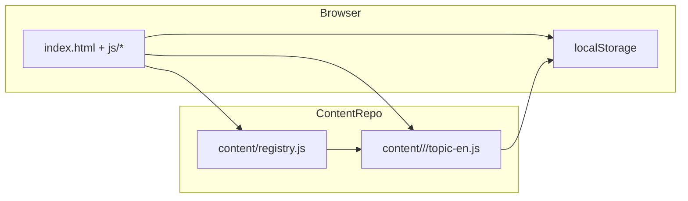
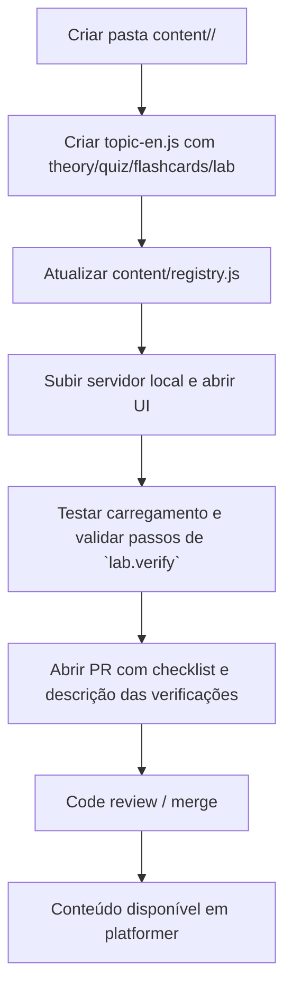

# platformer — Plataforma de Estudo Local

Resumo rápido
- Plataforma offline/local para estudar Kubernetes, SRE e Platform Engineering.
- Conteúdo versionado em `content/` com teoria, quizzes, flashcards e labs práticos.
- Engine mínima em `index.html` e `js/` carrega conteúdo dinamicamente via `content/registry.js`.

**Como a plataforma funciona**

- O arquivo central é `content/registry.js`: ele descreve domínios, tracks e tópicos (metadados, pesos, caminhos).
- Cada tópico vive em `content/<domain>/<topic>/topic-en.js` (ex.: `content/cluster-architecture/pods/topic-en.js`) e exporta um objeto com campos:
  - `theory` (markdown/strings), `quiz` (array), `flashcards` (array) e `lab` (objeto com steps/hints/verify).
- A UI (`index.html` + `js/`) carrega `registry.js`, constrói a sidebar e carrega os arquivos `topic-en.js` sob demanda (lazy loading).
- Progresso e estado do usuário são salvos em `localStorage` (visível via DevTools) e gerenciados pelo `js/state.js`.

**Diagrama de arquitetura (visão geral)**



**Executar localmente**

Recomendado: rodar um servidor HTTP simples para evitar restrições de CORS/arquivo.

Python 3 (recomendado):
```powershell
# na raiz do repositório
python -m http.server 8000
# Abra http://localhost:8000 no navegador
```

Alternativa Node (serve):
```bash
npx serve -s . -l 8000
```

Ou abra `index.html` diretamente (algumas features podem exigir servidor).

**Adicionar novo conteúdo (roteiro)**

1. Criar pasta do tópico
   - Estrutura: `content/<domain>/<topic>/`
2. Criar arquivo de conteúdo
   - Nome: `topic-en.js`
   - Modelo mínimo (JS):
```js
window.K8S_CONTENT_EN = window.K8S_CONTENT_EN || {};
window.K8S_CONTENT_EN['<domain>/<topic>'] = {
  theory: `# Título\nConteúdo`,
  quiz: [ /* perguntas */ ],
  flashcards: [ /* flashcards */ ],
  lab: { scenario: '', steps: [] }
};
```
3. Atualizar `content/registry.js`
   - Adicionar uma entrada no `domains` apropriado (no array `topics`) com os campos: `id`, `name`, `difficulty`, `path`, `hasQuiz`, `hasFlashcards`, `hasLab`, `tags`.
   - Ex.:
```js
{ id: 'meu-topico', name: 'Meu Tópico', difficulty: 'medium', path: 'meu-domain/meu-topico', hasQuiz: true, hasFlashcards: true, hasLab: true, tags: ['exemplo'] }
```
4. Testar carregamento
   - Suba o servidor e abra a UI. Navegue até o domínio e verifique se o tópico aparece e carrega.

**Fluxo para adicionar conteúdo (visual)**



**Formato de tópico (boas práticas)**
- `theory`: explique com exemplos e comandos (blocões de ```bash``` e ```yaml```).
- `lab`: include `objective`, `duration`, `steps[]` com `instruction`, `hints`, `solution` e `verify` commands.
- `quiz`: cada item deve ter `question`, `options` (array), `correct` (index) e `explanation`.
- `flashcards`: `{front, back}`.

**Estrutura do repositório (prévia)**
- `index.html` — app single page
- `css/` — estilos
- `js/` — engine: `renderer.js`, `router.js`, `state.js`, `lab.js`, `quiz.js`, etc.
- `content/` — todos os tópicos em subpastas + `registry.js` (índice)

**Progresso & evidências**
- A plataforma registra progresso localmente; para gerar evidências use screenshots, gravações das labs, commits com scripts/infra e colecione PRs relacionados.

**Contribuindo**
- Fork & PR: crie um branch, adicione o tópico e atualize `content/registry.js`, abra PR descrevendo o novo material e exemplos de verificação.
- Mantenha o padrão de formatação (exemplos nos tópicos existentes). Inclua referências e links de leitura.

**Checklist mínimo para aceitar novo tópico**
- [ ] `topic-en.js` presente e carga sem erros
- [ ] Entradas no `registry.js` atualizadas
- [ ] Lab com `verify` commands ou steps claros
- [ ] Quiz com pelo menos 5 perguntas (recomendado)

**TOC — Conteúdos disponíveis hoje (agregado por tema)**

- Kubernetes & Core (CKA/CKAD topics)
  - Cluster architecture, Pods, RBAC, kubeadm, etcd, CRDs & Operators
  - Workloads: Deployments, ConfigMaps/Secrets, Scheduling, Autoscaling
  - Services & Networking: Services, Ingress, CoreDNS, NetworkPolicies
  - Storage: PV/PVC, Volumes, StorageClasses
  - Troubleshooting: App failures, Cluster/node debugging, Network troubleshooting

- Cloud & Infrastructure (AWS/Azure patterns)
  - Cloud fundamentals, infra patterns, multi-account, resilience and HA
  - Terraform & IaC patterns, terraform-k8s
  - Cloud-native architecture and provider-specific topics

- Observability & Monitoring
  - Prometheus (architecture, PromQL, alerting), Grafana (dashboards & alerting), OpenTelemetry, Loki
  - Probes, logging, metrics, tracing and SLOs

- Delivery & GitOps
  - ArgoCD fundamentals & patterns, FluxCD, CI/CD (Tekton, GitHub Actions), Helm & Kustomize
  - Deployment strategies, rollout, sync strategies, ApplicationSets

- Platform Engineering
  - IDP concepts, golden paths, Backstage, Crossplane/Platform APIs, platform patterns and maturity

- Security & Supply Chain (CKS/KCSA)
  - Vault integration, cert-manager, external-secrets
  - CIS Benchmarks, API server security, service account hardening
  - Image scanning, image hardening, image signing (supply chain)
  - Pod Security Standards, OPA/Gatekeeper, Falco, audit logging

- Networking & Service Mesh
  - Cilium (fundamentals & advanced), Hubble, BGP/LB, ClusterMesh
  - Istio fundamentals & advanced (traffic management, mTLS, observability)

- SRE & Operations
  - SRE principles (SLIs/SLOs), incident management, on-call/runbooks, capacity planning
  - Toil automation, operational excellence, DORA metrics

- Platform-specific & Advanced Topics
  - Chaos engineering, Crossplane compositions, keda, service meshes, advanced observability patterns
