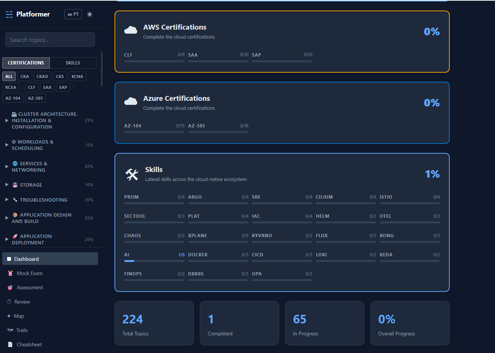
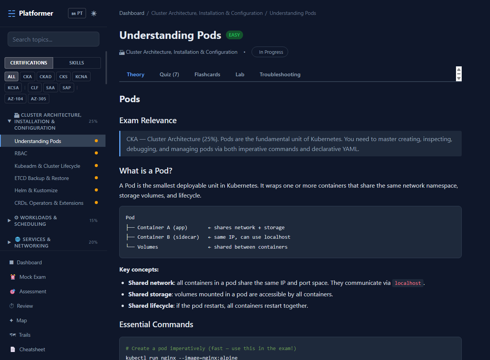
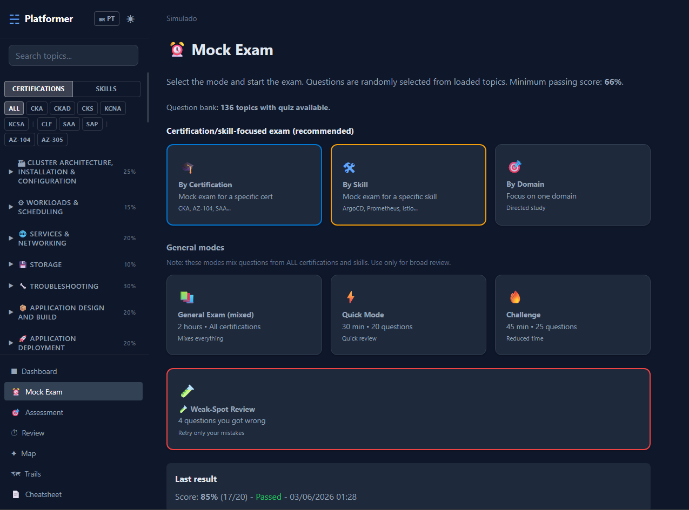
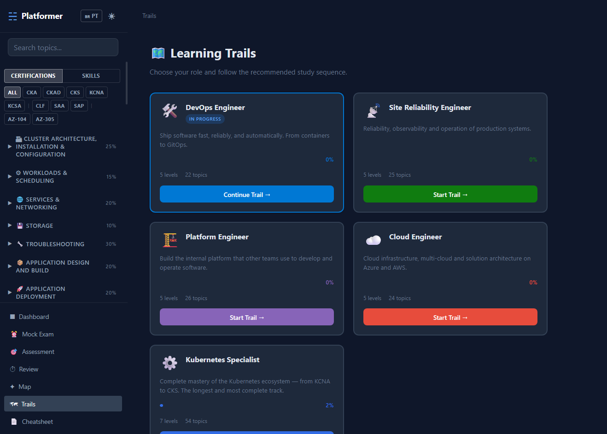
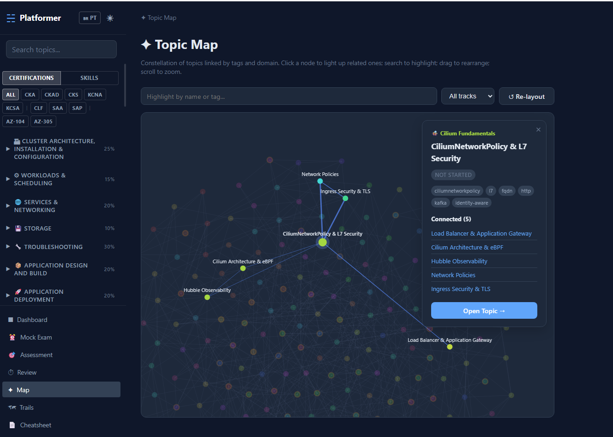
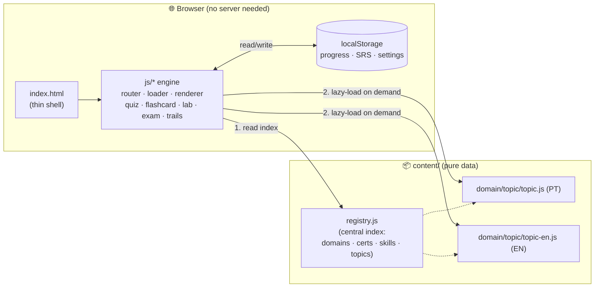

<div align="center">

# 🛰️ Platformer

### A local-first study platform for Cloud Native & Cloud certifications

Study **Kubernetes (CKA · CKAD · CKS · KCNA · KCSA)**, **AWS (CLF · SAA · SAP)** and **Azure (AZ-104 · AZ-305)** — plus 23 lateral skill tracks — entirely **offline, in a single browser tab**.

No backend. No database. No build step. No internet required.

### [🚀 Live Demo → kimidomaru.github.io/Platformer](https://kimidomaru.github.io/Platformer)

[](https://kimidomaru.github.io/Platformer)




> ⚠️ **Study aid, not a source of truth.** This is a personal study project. Its content is **AI-assisted and not exhaustively reviewed** — always confirm details against the [official documentation](#disclaimer--content-accuracy) before relying on them for an exam or in production.

</div>

---

## Table of Contents

- [What is Platformer?](#what-is-platformer)
- [Disclaimer & content accuracy](#disclaimer--content-accuracy)
- [Screenshots](#screenshots)
- [Features](#features)
- [Content coverage](#content-coverage)
- [Career trails](#career-trails)
- [How it works (architecture)](#how-it-works-architecture)
- [Running locally](#running-locally)
- [Fork it: build your own study platform](#fork-it-build-your-own-study-platform)
- [Adding a new topic](#adding-a-new-topic)
- [Repository layout](#repository-layout)
- [Tech & design decisions](#tech--design-decisions)
- [License](#license)

---

## What is Platformer?

**Platformer** is a self-contained, offline study application for technical certifications. The entire UI is plain HTML/CSS/JavaScript (no framework, no bundler), and **all study material lives as data** under `content/`. The engine reads a central index (`content/registry.js`) and lazy-loads each topic on demand.

It started as a personal study tool and is shared openly in case it's useful to others. It is **not** an official course, and it is **not** affiliated with the CNCF, the Linux Foundation, AWS, or Microsoft.

The guiding principle is a **hard separation between engine and content**:

> The platform is generated once. After that, *only content is added* — never the engine. You can drop in a new topic without touching a single line of `index.html`, `js/`, or `css/`.

This makes it trivial to **fork and re-theme** the project for *any* subject — DevOps, networking, a language certification, internal onboarding — by replacing the contents of `content/`.

---

## Disclaimer & content accuracy

Please read this before using the material to prepare for an exam.

- **AI-assisted content.** The theory, quizzes, flashcards, labs and troubleshooting scenarios were **generated with the help of large language models** and are **not exhaustively human-reviewed**. Expect occasional inaccuracies, outdated API versions, or commands that need adapting to your environment.
- **Always verify against official sources.** Treat this as a study companion, not an authority. Cross-check anything important with the official docs:
  [kubernetes.io/docs](https://kubernetes.io/docs/) · [docs.aws.amazon.com](https://docs.aws.amazon.com/) · [learn.microsoft.com](https://learn.microsoft.com/) · [training.linuxfoundation.org](https://training.linuxfoundation.org/) (CKA/CKAD/CKS/KCNA/KCSA).
- **Run labs in a throwaway environment.** Practice in a disposable cluster/sandbox (kind, minikube, k3s, a personal cloud account), never against production. Commands are provided as-is, **without warranty**.
- **No guarantee of exam outcomes.** Passing scores and exam formats change; this project may lag behind. It does not guarantee you will pass any certification.
- **Trademarks** (Kubernetes, CKA, CKAD, CKS, KCNA, KCSA, AWS, Azure, etc.) belong to their respective owners and are used here for descriptive, educational purposes only.
- **Found a mistake?** Corrections are very welcome — please open an issue or a pull request. Community review is exactly how this content improves.

---

## Screenshots

| Topic view — theory, quizzes, flashcards, labs & troubleshooting in tabs |
|---|
|  |

| Mock Exam — certification/skill-focused by default | Learning Trails — role-based study paths |
|---|---|
|  |  |

| Topic Map — the whole knowledge graph |
|---|
|  |

---

## Features

- 🎯 **Mock exams** — *certification/skill-focused by default* (scoped to one cert or one skill, with full/quick/challenge lengths). A separate, clearly-flagged "general mode" mixes everything for broad review.
- 📝 **Quizzes** — per-topic multiple-choice with explanations and study references after each answer.
- 🃏 **Flashcards with spaced repetition** — SM-2 scheduling (Again/Hard/Good/Easy), due badges, per-card persistence.
- 🧪 **Hands-on labs** — scenario, objective, estimated duration, step-by-step instructions with hints, solutions, and **`verify` commands** to self-check.
- 🚑 **Troubleshooting scenarios** — symptom → diagnosis → solution, graded by difficulty.
- 🛤️ **Learning trails** — 6 role-based career paths (DevOps, SRE, Platform Engineer, Cloud Engineer, K8s Specialist, AI for DevOps/SRE) with curated levels, checkpoints and certification milestones. Every topic in the catalog is reachable from at least one trail.
- 🌌 **Topic map** — an interactive constellation of all topics linked by tags.
- 📊 **Progress tracking** — per-topic state (*not started / in progress / completed*) persisted in `localStorage`.
- 🔎 **Local search**, 🌓 **dark mode**, 🌐 **bilingual UI (EN/PT)**, and a 📋 **cheatsheet** view.

---

## Content coverage

| | Count |
|---|---|
| **Topics** | **231** (every topic ships quiz + flashcards) |
| **Hands-on labs** | ~175 |
| **Domains** | 77 |
| **Skill tracks** | 23 |
| **Certifications** | 10 |
| **Career trails** | 6 |
| **Languages** | English + Portuguese (full parity) |

**Certification tracks**

| Cloud Native (Kubestronaut path) | AWS | Azure |
|---|---|---|
| CKA · CKAD · CKS · KCNA · KCSA | CLF · SAA · SAP | AZ-104 · AZ-305 |

**Skill tracks** *(certification-independent)*: Cilium & eBPF, Istio, Kong, Prometheus, Grafana, Loki, OpenTelemetry, ArgoCD, FluxCD, Helm, Kyverno, OPA/Gatekeeper, KEDA, Crossplane, Chaos Engineering, FinOps, SRE Practices, Platform Engineering, Databases-on-K8s, Security Tooling (Vault · cert-manager · external-secrets), Terraform/IaC, CI/CD, AI Engineering.

**Notable depth areas**

| Area | What's covered |
|---|---|
| **CKA (2025 curriculum)** | Full exam surface including Gateway API, crictl/containerd debugging, kubectl speed/JSONPath — new in the 2025 revision |
| **Cilium & eBPF** | Architecture, Hubble, NetworkPolicy, BGP/LB, Cluster Mesh, Service Mesh, **Tetragon (runtime security)**, **WireGuard/IPsec encryption**, **Egress Gateway** |
| **Istio** | Traffic management, security/mTLS, observability, advanced patterns, **Ambient Mesh (ztunnel + waypoint, GA Istio 1.24)** |
| **Crossplane** | Fundamentals (with hands-on lab), Providers, Compositions with **Composition Functions/pipeline mode** (P&T deprecated) |
| **Platform Engineering** | IDP concepts, Backstage, Golden Paths, **Platform Metrics (DORA · SPACE · adoption)** |
| **CKS** | All 6 exam domains with labs: CIS benchmarks, API server hardening, Seccomp/AppArmor, supply chain (image scanning/signing), Falco runtime security |

---

## Career trails

Six role-based paths cross-reference topics from multiple domains into a structured learning journey. Each trail shows per-level progress, certification checkpoints, and links directly into topics.

| Trail | Levels | Topics | Target certifications |
|---|---|---|---|
| 🛠️ **DevOps Engineer** | 4 | 30 | CKAD → CKA |
| 📡 **Site Reliability Engineer** | 4 | 35 | CKA |
| 🏗️ **Platform Engineer** | 5 | 51 | CKA → CKS |
| ☁️ **Cloud Engineer** | 4 | 27 | AZ-104 → AZ-305 → AWS SAA |
| ⚙️ **Kubernetes Specialist** | 7 | 63 | KCNA → CKA → CKAD → KCSA → CKS |
| 🤖 **AI for DevOps / SRE** | 3 | 6 | — |

---

## How it works (architecture)



**Boot flow**

1. `index.html` loads the engine scripts and `content/registry.js`.
2. `registry.js` defines `window.K8S_REGISTRY` — the catalog of certifications, skill tracks, domains and topics (each with metadata + a `path`).
3. The sidebar, dashboard, trails and search are built entirely from that registry.
4. When you open a topic, `loader.js` fetches `content/<domain>/<topic>/topic.js` (PT) or `topic-en.js` (EN) **on demand** (lazy loading) — these set `window.K8S_CONTENT` / `window.K8S_CONTENT_EN`.
5. `renderer.js` renders the topic's theory/quiz/flashcards/lab/troubleshooting tabs.
6. State (progress, SRS schedule, theme, language) is read/written to `localStorage` via `state.js`.

The key win: **adding content never touches the engine.** New topics are new data files + one registry entry.

---

## Running locally

Because content is lazy-loaded with `fetch`, serve over HTTP (opening `index.html` via `file://` may hit CORS limits in some browsers).

**Python (recommended — zero dependencies):**

```bash
# from the repository root
python -m http.server 8000
# open http://localhost:8000
```

> 💡 Any static file server works (e.g. `php -S localhost:8000`, VS Code "Live Server", `caddy file-server`). No Node toolchain is required.

That's it — no install, no build, no environment variables.

---

## Fork it: build your own study platform

Platformer is designed to be **re-skinned for any subject**. To turn it into *your* study platform:

1. **Fork & clone** this repository.
2. **Wipe the content** — delete the subfolders under `content/` (keep `registry.js`).
3. **Reset the index** — empty the `domains`, `certifications` and `skillTracks` arrays in `content/registry.js`.
4. **Add your domains** — one entry per subject area, each with a `topics: []` array.
5. **Add topics** — follow [Adding a new topic](#adding-a-new-topic) below for each piece of content.
6. **(Optional) Re-brand** — change the title in `index.html`, swap colors in `css/variables.css`, edit UI strings in `js/i18n.js`.
7. **Ship it** — push to GitHub and enable **GitHub Pages** (Settings → Pages → deploy from branch). It's fully static, so Pages serves it as-is.

You now have a free, offline, framework-free study platform for *any* topic, with quizzes, flashcards, spaced repetition, labs and mock exams included.

> ✍️ **AI-assisted authoring:** the content schema is intentionally LLM-friendly. Each `topic.js` is a single declarative object, so you can prompt an LLM to generate well-formed topics in bulk (this repo's content was authored this way).

---

## Adding a new topic

**1. Create the content file** `content/<domain>/<topic>/topic.js`:

```javascript
window.K8S_CONTENT = window.K8S_CONTENT || {};
window.K8S_CONTENT['my-domain/my-topic'] = {
  theory: `# My Topic

## Key Concepts
Concise, practical explanation with \`code\` and examples.

\`\`\`bash
kubectl get pods
\`\`\`
`,
  quiz: [
    {
      question: 'What does X do?',
      options: ['A', 'B', 'C', 'D'],
      correct: 0,                       // 0-based index of the right answer
      explanation: 'Why A is correct.',
      reference: 'Related concept: study section Y.'   // optional post-answer hint
    }
    // ≥ 5 questions recommended (7–10 gives the mock exam more variety)
  ],
  flashcards: [
    { front: 'Question?', back: 'Complete answer.' }
    // ≥ 6 recommended
  ],
  lab: {
    scenario: 'Practical scenario description.',
    objective: 'What the learner will achieve.',
    duration: '15–20 minutes',
    steps: [
      {
        title: 'Step title',
        instruction: 'What to do (`markdown`).',
        hints: ['hint 1', 'hint 2'],
        solution: '```bash\nkubectl ...\n```',
        verify: '```bash\nkubectl get ...\n# Expected: ...\n```'   // how to self-check
      }
    ]
  },
  troubleshooting: [
    {
      title: 'Scenario name',
      difficulty: 'easy',               // easy | medium | hard
      symptom: 'What looks wrong.',
      diagnosis: '```bash\nkubectl describe ...\n```',
      solution: 'Explanation + fix commands.'
    }
  ]
};
```

> For a bilingual copy, mirror the file as `topic-en.js` using `window.K8S_CONTENT_EN`.

**2. Register it** — add one entry to the matching domain's `topics: []` array in `content/registry.js`:

```javascript
{
  id: 'my-topic',
  name: 'My Topic',
  difficulty: 'medium',                 // easy | medium | hard
  path: 'my-domain/my-topic',           // must match the content key above
  hasQuiz: true,
  hasFlashcards: true,
  hasLab: true,
  tags: ['tag1', 'tag2']
}
```

**3. Verify** — start the server, open the UI, navigate to your topic, and confirm every tab renders.

### Minimum checklist to accept a topic

- [ ] `topic.js` present and loads without console errors
- [ ] `topic-en.js` present with the same content keys (PT/EN parity)
- [ ] `registry.js` updated with a matching `path`
- [ ] Quiz has ≥ 5 questions with `explanation`
- [ ] Flashcards have ≥ 6 cards
- [ ] Lab steps include `verify` commands and a `duration`
- [ ] Troubleshooting scenarios include a `difficulty`

---

## Repository layout

```
.
├── index.html              # Thin SPA shell — loads the engine + registry
├── css/
│   ├── variables.css       # Design tokens, theming, dark mode
│   ├── layout.css          # Page structure
│   └── components.css      # Cards, flashcards, quiz, lab, exam components
├── js/                     # Engine (vanilla JS, one IIFE module per file)
│   ├── app.js              # Bootstrap
│   ├── router.js           # Hash-based routing (#dashboard, #exam, #topic/...)
│   ├── loader.js           # Lazy-loads topic content
│   ├── state.js            # localStorage progress & settings
│   ├── renderer.js         # Topic rendering (tabs)
│   ├── i18n.js             # EN/PT string tables
│   ├── quiz.js             # Quiz engine
│   ├── flashcard.js        # Flip cards
│   ├── srs.js              # SM-2 spaced repetition
│   ├── lab.js              # Hands-on labs
│   ├── exam.js             # Mock exam engine (cert/skill-scoped + general)
│   ├── trails.js           # Role-based career trails (6 paths)
│   ├── search.js           # Local search
│   ├── dashboard.js        # Progress dashboard
│   ├── constellation.js    # Topic map (knowledge graph)
│   ├── sidebar.js          # Sidebar navigation
│   ├── review.js / assessment.js / cheatsheet.js / theme.js / markdown.js
│   └── ...
├── content/                # ALL study material (pure data)
│   ├── registry.js         # Central index — domains, certs, skills, topics
│   └── <domain>/<topic>/
│       ├── topic.js        # Content (PT) → window.K8S_CONTENT
│       └── topic-en.js     # Content (EN) → window.K8S_CONTENT_EN
└── assets/screenshots/     # README images
```

---

## Tech & design decisions

| Decision | Rationale |
|---|---|
| **Vanilla JS, no framework** | Zero build, zero dependencies, no supply-chain churn. Opens and runs for years without `npm install`. |
| **No bundler / no build step** | The repo *is* the deployable artifact. Clone and serve. |
| **Content as data, not code** | Engine and content evolve independently; new topics can't break the app shell. |
| **Lazy loading per topic** | Fast first paint and low memory even with 230+ topics. |
| **`localStorage` for state** | Fully offline; no accounts, no server, no privacy concerns. |
| **IIFE modules** | Simple namespacing without a module loader; works from `file://` and HTTP alike. |
| **Full PT/EN parity** | Every topic ships both `topic.js` (PT) and `topic-en.js` (EN). The loader falls back gracefully. |
| **LLM-friendly schema** | Declarative topic objects make automated/bulk content generation reliable and consistent. |

---

## License

Recommended: **MIT** (add a `LICENSE` file at the repo root before publishing a fork).

The code and study content are provided **"as is", without warranty of any kind**, for personal educational use. See [Disclaimer & content accuracy](#disclaimer--content-accuracy) — always verify exam-specific details against official documentation.

---

<div align="center">
<sub>Built as a local-first, framework-free study tool. Fork it and make it yours.</sub>
</div>
